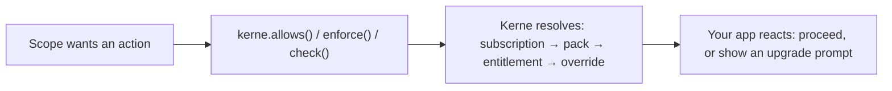

Kerne answers one question, asked on every request: **does this scope have the right to do that, right now, given what it pays?**

Everything else in the platform exists to make that one decision correct and fast.

## The two halves of the model

**Identity** - who is making the request. A user signs up, logs in, and holds a session. See [Identity & access](/concepts/identity).

**Monetization** - what that user is entitled to. A user subscribes to a `Plan`, which pins a versioned `Pack` of `Feature` entitlements at subscription time. See [Monetization](/concepts/monetization).

A **scope** is whoever the entitlement belongs to - today that's always a single user (`scope_type: "USER"`). Organization/team scopes aren't built yet - see below.

## What exists today

- Email/password and magic-link-style sessions, invitation-gated or open registration, a waitlist.
- Products, plans (versioned via packs, so upgrading a plan's entitlements never silently changes what existing subscribers get - see [grandfathering](/concepts/monetization/products-and-plans)), and three entitlement types: boolean flags, numeric quotas, and static config values.
- Stripe and Polar as payment rails - Kerne is always the source of truth for entitlements, the provider only handles money movement.
- A single admin flag per user (`global_role`), not a permissions system.

## What's intentionally not built yet

Being explicit about this matters more than it sounds - a doc that describes a half-built feature as if it were finished costs you more trust than one that says "not yet."

- **Organizations / teams.** Every scope is a single user. A workspace shared by multiple people, with pooled or per-member quotas, isn't implemented.
- **Role-based access control.** There's no permission system beyond one admin/non-admin flag - no custom roles, no per-resource permissions.
- **OAuth / social login.** Only email+password and magic-link-style flows exist.

If your product needs any of these today, it's worth knowing before you build against Kerne - not after.

## Next

<CardGroup cols={2}>
  <Card title="Identity & access" icon="fingerprint" href="/concepts/identity">
    Registration modes, sessions, and what "authorization" means today.
  </Card>
  <Card title="Monetization" icon="credit-card" href="/concepts/monetization">
    Products, plans, packs, and entitlements.
  </Card>
</CardGroup>
